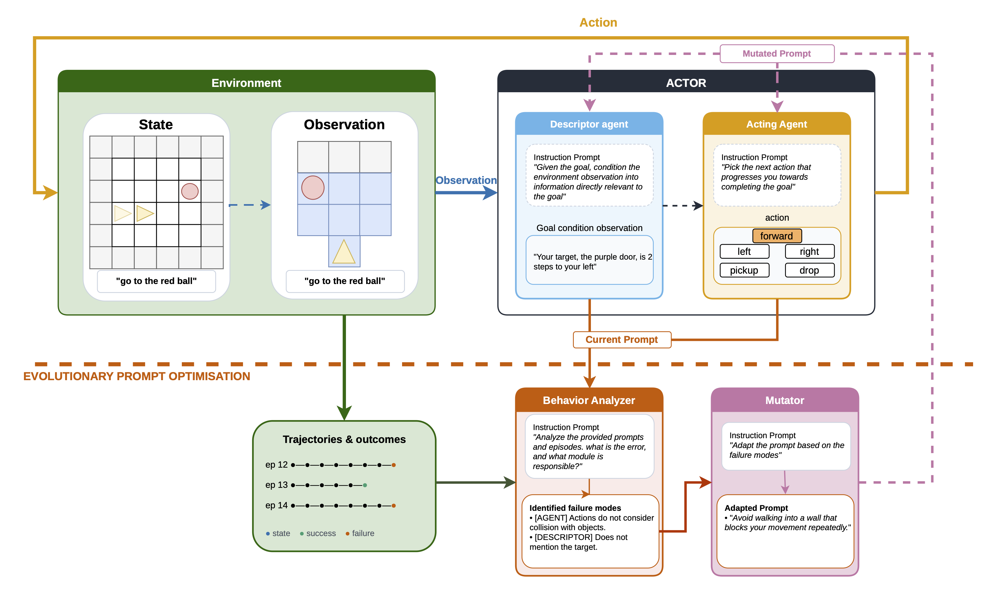

# Environment-Grounded Automated Prompt Optimization for LLM Game Agents

This repository implements **RAPOA** (*Reward-driven Automatic Prompt Optimization for Agentic systems*), an automated prompt optimization framework for LLM agents in interactive environments. Rather than optimizing model weights, RAPOA iteratively refines agent prompts using environment returns as the optimization signal.

The primary agent architecture evaluated is the **SPA** (*Split Perception Action*) agent, which decomposes the observation-to-action pipeline into two LLM roles: a **descriptor** ($A_{des}$) that translates raw environment observations into a mission-focused natural language summary, and an **action selector** ($A_{act}$) that uses that summary to plan and act. An optimization loop then automatically refines the prompts for both roles through a Behavior Analyzer → Mutator → two-stage Evaluator cycle guided by episode trajectories.

RAPOA is general: it can also be applied to monolithic agents (as demonstrated with the BALROG RobustCoTAgent baseline).

Current testbed: [BabyAI](https://github.com/mila-iqia/babyai) / [MiniGrid](https://github.com/Farama-Foundation/MiniGrid). Long-term target: NetHack.

> **Paper:** [citation placeholder]



---

## Installation

### Prerequisites

- Python 3.10+
- [uv](https://docs.astral.sh/uv/) package manager
- A GPU with an OpenAI-compatible inference server running (see [Setting Up an Inference Server](#setting-up-an-inference-server))

### Clone

RAPOA includes [BALROG](https://github.com/balrog-ai/BALROG) as a git submodule — no separate conda install is needed. Clone with submodules initialized:

```bash
git clone --recurse-submodules https://github.com/ReanFernandes/rapoa
cd rapoa
```

Or if already cloned without submodules:

```bash
git submodule update --init --recursive
```

### Install

```bash
uv sync
uv pip install -e external/BALROG
uv run balrog-post-install
```

`uv sync` installs all Python dependencies. `uv pip install -e external/BALROG` installs the BALROG package from the submodule into the same environment (BALROG's conda-based install from their README is not required here). `balrog-post-install` fetches the required game assets.

Activate the environment before running any commands:

```bash
source .venv/bin/activate
```

---

## Setting Up an Inference Server

RAPOA requires an OpenAI-compatible inference server. Any model served via [vLLM](https://docs.vllm.ai/) or [LM Studio](https://lmstudio.ai/) will work.

**All paper experiments were run using `gpt-oss-20b`.** This is the default model assumed throughout the pipeline — if no model is specified anywhere, `gpt-oss-20b` is used. To reproduce paper results, use this model. To experiment with other models, change the model name in `conf/models/local.yaml` and the pipeline will use it instead.

> **Note on multi-model support:** The codebase has infrastructure for running across multiple GPU endpoints simultaneously (used on our cluster), but this has only been tested with a single model. Using different models across endpoints is not yet tested and may cause unexpected behavior.

**Install vLLM and start the server:**

```bash
uv sync --extra server
bash run_experiments/start_server.sh
```

This installs vLLM into the project venv and starts a server on port 8000 serving `gpt-oss-20b`. vLLM requires a CUDA-capable GPU.

**Or use LM Studio:** start any model via the GUI and enable the local server (defaults to port 1234) — no GPU driver setup required.

Once the server is running, `conf/models/local.yaml` is pre-configured for the paper setup and should work as-is:

```yaml
strong:
  name: gpt-oss-20b
  endpoint: http://127.0.0.1:8000/v1
```

To use a different model, update `name` to match the model ID your server advertises and `endpoint` to match its address. All configs default to `models: local` and will read from this file.

---

## Checking Your Setup

Verify that BALROG, MiniGrid, and your inference server are all reachable:

```bash
python tools/check_setup.py
```

Then run the test suite to confirm the core pipeline logic is intact:

```bash
pytest
```

---

## Running a Non-Optimized Baseline

Before running the optimization loop, it is useful to watch the agent play with its starting (progenitor) prompts. Pass `--gif` to save an animated replay of each episode:

```bash
# SPA agent with guided prompts on GoTo, 10 episodes, saves GIFs
bash run_experiments/run_baseline.sh --gif
```

GIFs are written to `logs_baseline/goto/spa/guided/seed_1/`. Open any `.gif` to watch the agent navigate the environment.

To try different pipelines or tasks:

```bash
# BALROG baseline (monolithic agent), plain prompts, all tasks
bash run_experiments/run_baseline.sh --pipeline balrog --variant plain --all-tasks --gif

# SPA agent, guided prompts, putnext task, 20 episodes
bash run_experiments/run_baseline.sh --task putnext --episodes 20 --gif
```

Full paper baseline protocol (120 episodes per task, all inference seeds):

```bash
bash run_experiments/run_baseline.sh --full-eval --all-tasks
```

---

## Running the Optimization — Smoke Test

The smoke test runs one task for 2 optimization cycles end-to-end and is the canonical check that the full pipeline works:

```bash
python run_experiments/run_pipeline.py conf/configs/smoke_test.yaml
```

This runs the Behavior Analyzer → Mutator → Evaluator loop and writes results to:

```
optimization_runs/babyai/gpt-oss-20b/smoke_test_{timestamp}/{slug}/{task}/
  optimisation_log.jsonl      ← full prompt evolution history
  incumbent_agent_prompt.txt  ← best actor prompt found
  incumbent_descriptor_prompt.txt
```

Monitor progress while it runs:

```bash
python tools/opt_progress.py
```

---

## Running the Full Paper Experiments

Once the smoke test passes, launch the main experiments. Each config runs all conditions for that experiment group in parallel:

```bash
# SPA with guided prompts — HSP, LSP, always-accept, module ablations
python run_experiments/run_pipeline.py conf/configs/main/spa_guided.yaml

# SPA with plain prompts — same conditions
python run_experiments/run_pipeline.py conf/configs/main/spa_plain.yaml

# BALROG baseline — all history window and prompt conditions
python run_experiments/run_pipeline.py conf/configs/main/balrog.yaml

# Threshold sensitivity sweep (ablation)
python run_experiments/run_pipeline.py conf/configs/ablations/threshold_sweep.yaml
```

Each config runs optimization across all 5 tasks, then automatically triggers fresh evaluation on the final optimized prompts. Track optimization progress:

```bash
watch -n 60 'python tools/opt_progress.py'
```

Track fresh evaluation progress (runs after each experiment's optimization completes):

```bash
watch -n 60 'python tools/progress.py'
```

If a run is interrupted, resume it using `--campaign-override` with the original campaign directory. Find the campaign name by listing the output directory:

```bash
ls optimization_runs/babyai/gpt-oss-20b/
```

Then pass the directory name to `--campaign-override`:

```bash
python run_experiments/run_pipeline.py conf/configs/main/spa_guided.yaml \
  --campaign-override babyai/gpt-oss-20b/spa_guided_20260520_143022
```

Replace `spa_guided_20260520_143022` with the actual directory name from the `ls` output above.

---

## Visualizing Results

Once experiments are complete, generate figures and tables using the plotting scripts. First update `final_paper_plotting/config.py` to point at your campaign directories — replace the values in `CAMPAIGN_IDS` with the timestamped directory names created by `run_pipeline.py` (listed under `optimization_runs/babyai/gpt-oss-20b/`), then run:

```bash
# Main results heatmap
python final_paper_plotting/plot_heatmap.py

# Optimization trajectory plots
python final_paper_plotting/plot_opt_trajectory.py

# Threshold sensitivity
python final_paper_plotting/plot_threshold_sensitivity.py

# All results table (LaTeX + CSV)
python final_paper_plotting/gen_paper_tables.py
```

Output goes to `final_paper_plotting/figures/` and `final_paper_plotting/tables/`. See [`final_paper_plotting/README.md`](final_paper_plotting/README.md) for the full list of scripts and instructions on adapting them for new runs.

---

## Compute and Timing

A single evaluation run (1 inference seed, 20 episodes, step limit 64) takes roughly **15 minutes** for the easiest task and up to **45 minutes** for the hardest task (putnext). Wall time scales with the number of workers — more workers means more episodes run in parallel, up to the episode count.

A 20-cycle optimization run takes roughly **1–2 hours** for the easiest task (GoTo) and up to **15–46 hours** for the hardest one, (PutNext), depending on agent type — BALROG (1 LLM call per step) is at the low end, SPA (2 LLM calls per step, longer prompts) at the high end. The optimization is sequential by design: each cycle depends on the outcome of the previous one, so it cannot be parallelized across cycles.

---

## Paper Terminology vs Code Terminology

The codebase uses internal names that differ from the paper. The mapping is:

| Paper | Code |
|-------|------|
| `plain` | `minimal` (prompt variant) |
| `guided` | `rich` (prompt variant) |
| HSP (high selection pressure) | `validation_bag` (validation strategy) |
| LSP (low selection pressure) | `train_signal` (validation strategy) |
| δ (acceptance threshold) | `reward_threshold` in config |
| action selector ($A_{act}$) | `actor` in code |
| optimization phase | V bag episodes (`ba_episodes`) |
| selection phase | T pool (`t_size`) |

---

## Project Structure

```
conf/                  Config system — environment, models, agent, optimization params
experiments/           Core runners — run.py (episodes) and optimise.py (opt loop)
run_experiments/       Orchestration — run_pipeline.py and supporting shell scripts
src/                   Library code — config, environment, llm, optimization, pipeline
prompts/               Prompt files for each environment and LLM role
tools/                 Analysis and progress-tracking scripts
final_paper_plotting/  Plotting and table generation for paper figures
tests/                 pytest test suite
external/BALROG        BALROG benchmark (git submodule)
```

Each subdirectory has its own README with further detail.
